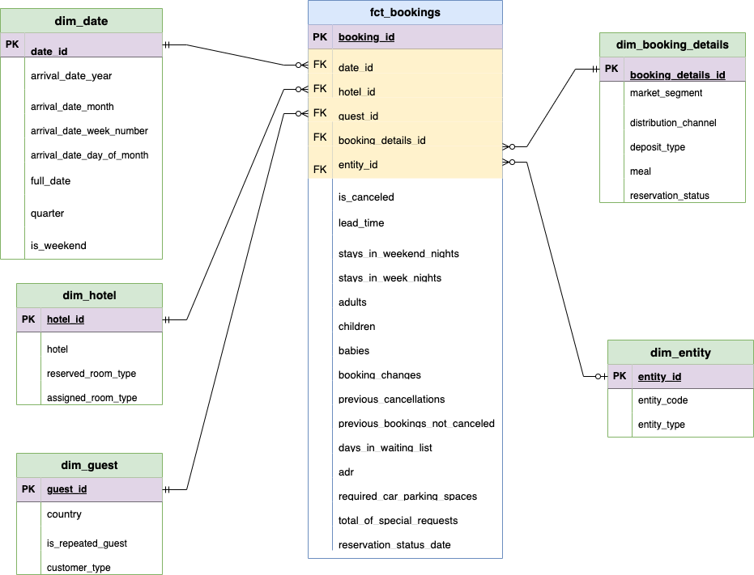

# Hotel Bookings Data Transformation with GCP, Airflow, and Astro

This project demonstrates how to build an ELT (Extract, Load, Transform) data pipeline to process and transform hotel booking data containing over 100,000 records using Google Cloud Platform (GCP), Apache Airflow, and Astronomer Astro. The pipeline extracts data from Google Cloud Storage (GCS), loads it into BigQuery, transforms it into dimensional and fact tables using dbt and Cosmos, and ensures data quality with Soda, creating a robust analytics-ready dataset for the hospitality sector.

## Features

- Extract CSV data from GCS and load it into a BigQuery staging table.
- Transform raw data into dimensional tables (e.g., `dim_date`, `dim_guest`, `dim_hotel_room`, `dim_booking_details`, `dim_entity`) and a fact table (`fct_bookings`) using dbt.
- Ensure data quality with Soda checks for both raw and transformed data.
- Orchestrate the pipeline using Apache Airflow and Astronomer Astro with Cosmos for dbt integration.

## Architecture

### Workflow

- **Extract**: Verify and retrieve the hotel_bookings.csv file from GCS.
- **Load**: Load raw CSV data into a BigQuery raw_bookings staging table.
- **Transform**:
  - Use dbt and Cosmos to create dimensional and fact tables in the transform layer.
  - Apply surrogate keys and handle NULLs with COALESCE for data consistency.
- **Quality Check**: Validate raw data with Soda, followed by comprehensive checks on transformed tables.
- **Orchestration**: Manage the pipeline execution sequence with Airflow and Astro.

### Data Layers

- **Staging Layer**: Raw hotel_bookings.csv data loaded into raw_bookings in BigQuery.
- **Transform Layer**: Cleaned and transformed tables (e.g., dim_date, fct_bookings) created by dbt.
  

### **Requirements**

- **Google Cloud Platform (GCP)**:
  - **Cloud Storage**: Stores the raw hotel_bookings.csv file.
  - **BigQuery**: Hosts the staging, transformed, and reporting tables.
- **Apache Airflow**: Orchestrates the pipeline with task scheduling and dependencies, enhanced by Astronomer Astro for a containerized environment.
- **dbt (Data Build Tool)**: Transforms data into analytics-ready tables using SQL models, integrated via Cosmos.
- **Cosmos**: Extends Airflow to run dbt projects, managing the transform layer efficiently.
- **Soda**: Ensures data quality with schema and validity checks on raw and transformed data.
- **Astronomer Astro**: Provides a managed Airflow environment with Docker support for scalability.
